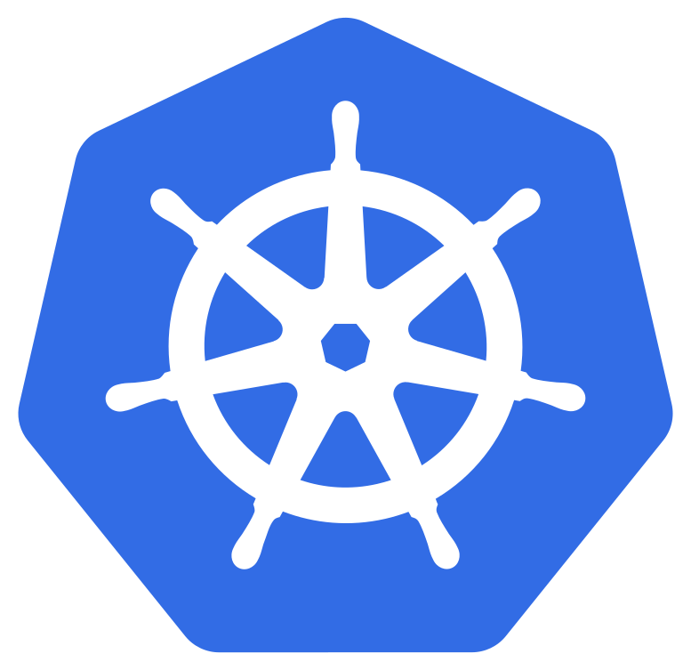
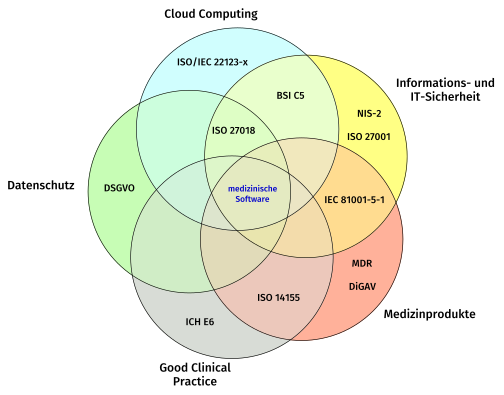

<!-- .slide: data-auto-animate -->

### Implementierung eines Sicherheitskonzepts für den Betrieb medizinischer Software in einer Cloud-Infrastruktur auf Basis von Kubernetes

Masterarbeit

<small>von Sebastian Fleer</small>

Note:
Thema in einem Satz: technisches Sicherheitskonzept für einen produktiv betriebenen Kubernetes-Cluster, auf dem medizinische Software läuft.
Auftraggeber und Anwendungsfall: movisens GmbH, Plattform TherapyDesigner.

---
<!-- .slide: data-auto-animate -->

## Übersicht
1. Digitalisierung im deutschen Gesundheitswesen
1. Vorstellung von movisens TherapyDesigner
1. Regulatorische Grundlagen
1. Sicherheitskonzept
1. Implementierung
1. Ergebnisse
1. Diskussion und Fazit

Note:
Aufbau: erst Problem und Anwendungsfall, dann die Regulatorik als Anforderungsquelle, daraus das Konzept, die Umsetzung im Cluster und am Ende Bewertung.
Die technischen Grundlagen zu Containern, Kubernetes und Infrastructure-as-Code überspringe ich, da sie beim Publikum vorausgesetzt werden können. Zusatzfolien dazu liegen am Ende bereit.
Schwerpunkt liegt auf Sicherheitskonzept, Implementierung und Ergebnissen.

---
<!-- .slide: data-auto-animate -->

## Digitalisierung im deutschen Gesundheitswesen

### Probleme

- Monolithische, veraltete IT-Systeme (KIS oft >20 Jahre alt)
- Unzureichende personelle und finanzielle Ausstattung
- Fachkräftemangel beeinträchtigt IT-Betrieb und -Sicherheit
- Erheblicher Investitionsstau behindert zeitgemäßen Datenaustausch
- Datenmengen steigen stark durch datengetriebene Medizin
- KHZG-Förderung unzureichend (Betriebskosten nicht gedeckt)
- Zunehmende Cyberangriffe auf Gesundheitseinrichtungen

Note:
Ausgangslage: die vorhandene Infrastruktur wächst den Anforderungen der datengetriebenen Medizin nicht mehr nach.
Der Fachkräftemangel ist wichtig für später: er ist die Begründung dafür, Maßnahmen zu priorisieren statt alle umzusetzen.

---
<!-- .slide: data-auto-animate -->

## Digitalisierung im deutschen Gesundheitswesen

### Cloud Computing

- Potenzieller Lösungsweg: Microservices, Cloud, Automatisierung (IaC)
- Ermöglicht gemeinsamen Betrieb mehrerer Häuser (Synergien)
- Reduziert administrativen Aufwand und schont Personalressourcen
- Cloud-Förderung kaum genutzt (nur 2,39% der KHZG-Förderanträge)
- Risiko: Vendor Lock-in durch anbieterspezifische Implementierungen
- Risiko: Steigende Betriebskosten (Cloud-Repatriation)
- Vorbehalte: Datenschutz, Datensicherheit, fehlende Erfahrung
- International bereits etabliert (z. B. Gen3-Plattform, NIH)
- Deutsche Beispiele: GKV Informatik, Charité, recruIT

Note:
Cloud gilt als wegbereitende Technologie, wird in Deutschland im Gesundheitswesen aber kaum genutzt.
Die Vorbehalte richten sich vor allem auf Datenschutz und Datensicherheit. Genau dort setzt die Arbeit an.
Die beiden Risiken Lock-in und Repatriation begründen die Nebenfrage nach Anbieterunabhängigkeit.

---
<!-- .slide: data-auto-animate -->

## Digitalisierung im deutschen Gesundheitswesen

### Bedeutung der Arbeit

- Forschungslücke: Konkrete Umsetzung von Sicherheitsmaßnahmen in Cloud/Kubernetes im Gesundheitswesen
- Ziel: Kubernetes-Plattform konform zu regulatorischen Sicherheitsvorgaben betreiben
- Ziel: Cloud-Anbieterunabhängigkeit (Vermeidung Vendor Lock-in)
- Einsatz ausschließlich cloudagnostischer Open-Source-Komponenten
- Anwendungsfall: Plattform *movisens TherapyDesigner* (Public Cloud)
- Fokus: Sicherheitsmaßnahmen auf Softwareebene in Kubernetes
- Übertragbarkeit der Ergebnisse auf andere medizinische Bereiche
- Methodik: Abgleich der *Threat Matrix for Kubernetes* mit regulatorischen Kernthemen

Note:
Hier die Forschungsfrage explizit nennen: Lässt sich eine Kubernetes-Plattform allein mit Kubernetes-eigenen Sicherheitsfunktionen und gängigen Open-Source-Lösungen konform zu den regulatorischen Sicherheitsvorgaben betreiben?
Nebenfrage: Bleibt dabei die Unabhängigkeit vom Cloud-Anbieter erhalten?
Literaturlage: wenige praxisnahe Veröffentlichungen, sowohl im Gesundheitswesen als auch zur Kubernetes-Absicherung allgemein.

---
<!-- .slide: data-auto-animate -->

## movisens TherapyDesigner

- Softwareplattform zur Erstellung MDR-konformer digitaler Therapiesysteme
- Selbst kein Medizinprodukt, aber erzeugte Systeme können es sein
- Entwicklung unter Berücksichtigung einschlägiger Normen für Medizinprodukte
- Nutzergruppen: Forschende, Behandelnde, Patienten, movisens-Entwickler
- Betrieb: Alle serverseitigen Komponenten als Container in Kubernetes (Public Cloud)
- Verwaltung: Terraform/OpenTofu, Helm Charts

Note:
Zweck der Plattform: Entwicklungsaufwand und Zeitdauer für digitale Therapiesysteme verringern, damit neue Therapieansätze schneller in klinischen Prüfungen evaluiert werden können.
Wichtige Abgrenzung: das Sicherheitskonzept betrifft die Cloud-Infrastruktur, nicht die Zulassung der erzeugten Therapiesysteme.

---
<!-- .slide: data-background="images/td_architecture.dot.svg" data-background-size="contain" -->

Note:
Architektur erklären: TherapyManager (Frontend, eigenes Backend, Hasura) für Forschende und Behandelnde, je Studie eine eigene TherapyExecutor-Instanz mit dedizierter PostgreSQL-Datenbank, Keycloak für Authentifizierung, TherapyApp als Client der Patienten.
Für das Konzept entscheidend: jede Studie hat ihre eigene Datenbank, und alle serverseitigen Komponenten laufen im selben Cluster.

---
<!-- .slide: data-auto-animate -->

## Regulatorische Grundlagen

 <!-- .element: class="img" data-preview-image data-preview-fit="contain" -->

Note:
Medizinische Software im Cloud-Betrieb liegt im Schnittbereich mehrerer regulierter Themenfelder: Medizinprodukte, Datenschutz, IT-Sicherheit, Good Clinical Practice und Cloud Computing.
Die Themenbereiche überschneiden sich, deshalb die Blütenform. Genannt sind jeweils Beispiele für Gesetze und Normen.
Erschwerend: die Dokumente stammen aus Recht, Betriebswirtschaft und Informatik und verwenden nicht deckungsgleiches Fachvokabular.
Abgrenzung nennen: maßgeblich ist nur der technische Anteil, Geltungsbereich sind die serverseitigen Komponenten und die Cluster-Administration, ein ISMS wird vorausgesetzt.

---
<!-- .slide: data-auto-animate -->

## Zehn regulatorische Kernthemen

1. Rollenbasierte Zugriffskontrollen
1. Schutz vor unerwünschten Netzwerkzugriffen
1. Schwachstellenmanagement
1. Schutz vor Schadsoftware
1. Protokollierung von Ereignissen und Datenzugriffen
1. Datensicherung
1. Datenverschlüsselung
1. Angriffserkennung
1. Konfigurationsmanagement mit Änderungshistorie
1. Tests aller Sicherheitsmaßnahmen auf Effektivität

Note:
Eigenleistung: aus den gesichteten Dokumenten wurden diese zehn technischen Kernthemen destilliert. Die exakten Anforderungen variieren je Dokument stark, die Themen wiederholen sich aber.
In der Arbeit ist jedes Kernthema in einer Referenztabelle mit konkreten Stellen in zehn Dokumenten belegt, von NIS-2 und CRA über MDR, ICH E6 R3 und IEC 81001-5-1 bis BSI TR-03161 und BSI C5. Auszug liegt als Zusatzfolie bereit.
Als Orientierung für die Strukturierung dienten die IG-NB-Fragebögen zu Cybersecurity, nicht als Belegquelle.
Diese zehn Themen sind der Maßstab, an dem am Ende die Vollständigkeit des Konzepts gemessen wird.

---
<!-- .slide: data-background="images/security_concept_context.dot.svg" data-background-size="contain" -->

Note:
Methodik: Bedrohungs- und Risikoanalyse in vier Stufen nach Angermeier. Untersuchungsgegenstand modellieren, Schutzbedarf feststellen, Bedrohungen analysieren, Risiken analysieren.
Wichtige Einordnung: das ist die Betriebssicht der IT-Sicherheit, nicht die Risikoanalyse der Medizinprodukte-Entwicklung. Bezugsobjekt ist ein bereits produktiv betriebener Cluster, betrachtet werden rein technische Maßnahmen, ein ISMS wird vorausgesetzt.
Entscheidend ist der Rückkopplungspfeil: das Sicherheitskonzept verändert das betrachtete System, damit ist die nächste Analyse zwingend erforderlich. Darauf komme ich am Ende zurück.

---
<!-- .slide: data-background="images/tm-detail-k8s.svg" data-background-size="contain" -->

Note:
Stufe 1: Datenflussdiagramm des TherapyDesigner-Clusters, erstellt mit der Python-Bibliothek pytm.
Drei relevante Vertrauensgrenzen: Internet zum Gateway Controller, Anwendungs-Pods zur Control Plane, Komponenten zu ihren persistenten Datenspeichern.
Zweck ist das Einstiegsartefakt: Umfang abgrenzen und Vertrauensgrenzen sichtbar machen. Beim Festlegen der Grenzen muss man konkret überlegen, wie ein Angreifer vorgeht.
Grenze offen benennen: ein DFD ist statisch, Kubernetes-Objekte sind flüchtig. Datenbank-Pods sind vereinfacht beim jeweiligen Konsumenten dargestellt. Die Bewertung erfolgt deshalb plattformspezifisch, nicht über das DFD.

---
<!-- .slide: data-auto-animate -->

## Stufe 2: Schutzbedarf feststellen

| Komponente | C | I | A |
| --- | --- | --- | --- |
| kube-apiserver | hoch | hoch | mittel |
| etcd | hoch | hoch | mittel |
| Gateway Controller | hoch | hoch | hoch |
| Container Registry | niedrig | hoch | mittel |
| Worker Node | hoch | hoch | mittel |
| Pod Network | hoch | hoch | hoch |
| Applikations-Pods | hoch | hoch | hoch |
| Observability-Stack | niedrig | hoch | mittel |

Note:
Zwei Ebenen: zuerst die TherapyDesigner-Komponenten, dann die Cluster-Komponenten aus dem DFD.
Bei den Applikationskomponenten ist der Schutzbedarf durchgängig hoch. Sachlich korrekt, zur Priorisierung aber unbrauchbar. Erst die Betrachtung des Clusters als Gesamtsystem differenziert.
Die Zeile Applikations-Pods bündelt alle TherapyDesigner-Komponenten und übernimmt deren Maximum je Schutzziel.

---
<!-- .slide: data-auto-animate -->

## Stufen 3 und 4: Bedrohungen und Priorisierung

- *Threat Matrix for Kubernetes*: 40 Bedrohungen, 32 Maßnahmen
- Aufbauend auf MITRE ATT&CK, plattformspezifisch für Kubernetes
- Alternativen abgewogen: STRIDE zu abstrakt, Attack Trees zu aufwendig
- Sechs Bedrohungen nicht anwendbar (kein IMDS, keine Managed Identities)
- Threat Matrix enthält keine Risikobewertung, daher eigenes Score-Modell
- Eingaben als CSV: Bedrohungen, Maßnahmen, Schutzbedarf
- Bedrohungs-Score: höchster CIA-Wert der betroffenen Komponente
- Maßnahmen-Score: Summe über alle adressierten Bedrohungen
- Spitze: MS-M9003 (Least-Privilege via RBAC), Score 48 aus 16 Bedrohungen

Note:
Die Threat Matrix liefert konkrete Angriffstechniken plus zugeordnete Maßnahmen, beides auf Kubernetes zugeschnitten. Damit entfällt der Zwischenschritt vom abstrakten Bedrohungstyp zur konkreten Cluster-Komponente.
Anwendbarkeitsprüfung ist Eigenleistung: der Support des Cloud-Anbieters wurde gezielt nach den vorausgesetzten Mechanismen gefragt. Ohne IMDS und Managed Identities entfallen fünf Bedrohungen und zwei Maßnahmen.
FAIR wurde verworfen, weil keine Häufigkeits- und Schadensdaten vorliegen. Das Score-Modell erfüllt Angermeiers fünf Auswahlkriterien und folgt dem Worst-Case-Prinzip.
Zweites Auswahlkriterium neben dem Score ist die Verfügbarkeit als Bordmittel, weil externe Werkzeuge Angriffsfläche mitbringen und selbst gehärtet werden müssen.
Bewusst einfach gehalten, damit es auch kleine IT-Teams ohne risikoanalytisches Spezialwissen anwenden können. Vollständige Ergebnistabelle und Ablaufdiagramm liegen als Zusatzfolien bereit.

---
<!-- .slide: data-auto-animate -->

## Abgleich mit der Regulatorik

- Kernthemen den Maßnahmen der Threat Matrix zugeordnet
- Fünf Kernthemen haben keine direkte Entsprechung
- Ergänzende Maßnahmen außerhalb des Katalogs erforderlich
- Cluster-weite Metriken und Anwendungs-Logs
- Malware-Scanning laufender Container
- Encryption at Rest für etcd und Persistent Volumes
- Versionskontrollierte Cluster-Konfiguration
- Periodische Effektivitätsprüfungen

Note:
Zentrales Zwischenergebnis: die Threat Matrix allein genügt nicht für den regulierten Betrieb. Sie deckt Angriffstechniken ab, nicht regulatorische Pflichten.
Beispiele: Image-Scans decken nur den Build-Pfad ab, nicht laufende Container. Encryption at Rest kommt in der Threat Matrix gar nicht vor. Effektivitätstests ebenfalls nicht.
Diese fünf Punkte werden als ergänzende Aspekte in das Konzept aufgenommen.

---
<!-- .slide: data-auto-animate -->

## Maßnahmen der Erstumsetzung

| ID | Maßnahme | nativ |
| --- | --- | --- |
| MS-M9003 | Least-Privilege via RBAC | ja |
| MS-M9014 | Netzwerksegmentierung | ja |
| MS-M9013 | Over-permissive Container | ja |
| MS-M9017 | Pod Security Standards | ja |
| MS-M9025 | Auto-Mount von SA-Tokens aus | ja |
| MS-M9029 | Requests und Limits | ja |
| MS-M9024 | etcd-Zugriff beschränken | ja |
| MS-M9031 | Backup-Strategie | nein |
| MS-M9020 | Audit-Logs extern speichern | teils |

<small>Ergänzt um die fünf Aspekte außerhalb der Threat Matrix</small>

Note:
Auswahl folgt zwei Kriterien: Score und Verfügbarkeit als Bordmittel. Sieben der neun Maßnahmen sind nativ in Kubernetes enthalten.
Lieferketten-Maßnahmen wurden als erstrebenswert eingestuft, aber nicht in die Erstumsetzung genommen, weil sie Änderungen am Entwicklungs- und Release-Ablauf erfordern.

---
<!-- .slide: data-auto-animate -->

## Implementierung

- Gesamter Cluster-Zustand als Infrastructure-as-Code mit OpenTofu
- Observability zuerst: Prometheus, Loki, Alloy, Grafana, Alertmanager
- Audit-Log des API-Servers extern in einem S3-Bucket (MS-M9020)
- Rollen- und Berechtigungskonzept über RBAC (MS-M9003)
- Netzwerksegmentierung über Network Policies (MS-M9014)
- Pod-Härtung über Pod Security Admission (MS-M9013, MS-M9017)
- Schwachstellenscans mit Trivy in der CI und per SBOM im Cluster
- Backups per CronJob, clientseitig verschlüsselt (MS-M9031)
- WireGuard zwischen Nodes, Encryption at Rest über den Provider

Note:
Observability zuerst, weil sich ohne belastbare Datenerfassung die Wirkung aller weiteren Maßnahmen nicht messen lässt.
Cluster-Konfiguration liegt in einem GitLab-Repository, main-Branch geschützt, Merge Requests mit Review durch eine zweite Person, Ausrollen durch die CI-Pipeline. Mitarbeitende brauchen im Regelfall keinen Schreibzugriff auf den Cluster.
Ergänzend zur Pod-Härtung: Auto-Mount der Service-Account-Tokens deaktiviert (MS-M9025), Requests und Limits je Container (MS-M9029), etcd durch das Managed-Kubernetes-Modell abgedeckt (MS-M9024).
Bewusster Verzicht auf zwei verbreitete Werkzeuge: kein Service Mesh und keine generische Policy-Engine wie Kyverno oder OPA Gatekeeper, weil die Bordmittel genügen und jede Zusatzkomponente Angriffsfläche und Wartungsaufwand vergrößert.
Alle Zusatzkomponenten sind quelloffen und cloudagnostisch, kein anbieterspezifischer Sicherheitsdienst.

---
<!-- .slide: data-auto-animate -->

## Zugriffskontrolle und Token-Self-Service

- Kubernetes kennt keine Objekte für menschliche Nutzer
- Client-Zertifikate nicht widerrufbar, Anbieter ohne OIDC-Anbindung
- Lösung: je Mitarbeiter ein Service-Account in einem eigenen Namespace
- Rollen Administrator, Entwickler und Support, versioniert in OpenTofu
- Eigenentwicklung: Backend gibt kurzlebige Tokens aus
- Identität über den verifizierten E-Mail-Claim des Zugriffstokens
- Signaturprüfung über den JWKS-Endpunkt des Providers
- Auslieferung als Distroless-Image über einen Multistage-Build
- Ausblick: Kopplung an Mehrfaktor-Authentifizierung (RFC 9470)

Note:
Anforderungen an die Zugriffskontrolle: eindeutige Zuordnung von Aktionen zu Personen, Least Privilege, begrenzte Gültigkeit, schnelle Anpassung und sofortige Sperrbarkeit.
Beide Standardwege fallen weg, deshalb der Weg über Service-Accounts. Das ist ausdrücklich als umgebungsspezifische Entscheidung gekennzeichnet.
Der Kern: Mitarbeitende holen sich selbst kurzlebige Zugänge, ohne dass Administratoren eingreifen oder langlebige Credentials existieren. Langlebige Credentials sind laut Literatur besonders im Offboarding-Fall ein Angriffsvektor.
Manipulation der E-Mail-Adresse ist nicht möglich, weil das Token mit dem privaten Schlüssel des Autorisierungsservers signiert ist. Nachvollziehbarkeit entsteht über das Audit-Log.
Sequenzdiagramm des Ablaufs liegt als Zusatzfolie bereit. Das Backend ist privilegiert und damit selbst ein Thema für die nächste Analyse.

---
<!-- .slide: data-auto-animate -->

## Network Policies

- Adressierung über Labels, da Pod-IP-Adressen flüchtig sind
- Durchsetzung durch das CNI (Calico), nicht durch Kubernetes selbst
- Bewusst keine CNI-spezifischen Erweiterungen, um portabel zu bleiben
- Default Deny für Ingress und Egress, DNS explizit freigegeben
- Je Service und Richtung eine Policy, Allowlist-Modell
- Jede Datenbank nur vom zugehörigen Konsumenten erreichbar
- Instanzweise Trennung der Studiendaten trotz gemeinsamem Namespace
- Limitierung: Egress auf 443/TCP für alle Executor-Instanzen (Firebase)
- Lösungsansatz: dediziertes Push-Gateway in eigenem Namespace

Note:
Wichtigste Eigenschaft: die Datenbank einer Studie ist von anderen Executor-Instanzen nicht erreichbar, obwohl alle Pods im selben Namespace laufen.
Grenzen der nativen Policy nennen: nur Layer 3 und 4, nur Allowlist, keine FQDN-Filterung, kein Logging, keine clusterweiten Regeln. Labels werden dadurch sicherheitsrelevant.
Zur Limitierung: Kubernetes-Policies kennen keine DNS-Namen, DNS-basierte Policies gibt es nur in Calico Enterprise, und Google veröffentlicht keinen abgegrenzten IP-Bereich für Firebase Cloud Messaging.
Das ist die schwerwiegendste Einschränkung der Arbeit, weil der Executor Studiendaten mit hohem Schutzbedarf verarbeitet. Kompensierend wirken Pod-Härtung und instanzweise Netzwerktrennung, die eine Ausbreitung auf andere Studien verhindert.

---
<!-- .slide: data-auto-animate -->

## Ergebnisse

### Umsetzungsstand

- Alle ausgewählten Maßnahmen umgesetzt außer Malware-Scanning
- Zusätzlich MS-M9005.001 (Image-Gating in der CI-Pipeline)
- Insgesamt zehn Maßnahmen der Threat Matrix implementiert
- MS-M9030 entfiel durch den anwendungsseitigen Backup-Ansatz
- Bordmittel erforderten nur Konfigurationsaufwand in der IaC-Struktur
- Nahezu keine Anpassungen an der Anwendungssoftware nötig
- Ausnahme: Komponenten mit privilegierten Ports unter 1024
- Eigener Entwicklungsaufwand nur für das Token-Self-Service-Backend

Note:
Das ist die Antwort auf den Aufwandsteil der Fragestellung: die Absicherung mit Bordmitteln ist überwiegend Konfigurationsarbeit, nicht Entwicklungsarbeit.
Der Verzicht auf Laufzeit-Malware-Scanning ist begründet: Container laufen mit Read-Only-Root-Filesystem, die Konfiguration legt fest, welche Images ausgeführt werden, und ein Scanner bräuchte weitreichende Privilegien im Cluster.
Backup-Details bei Bedarf über die Zusatzfolie: pg_dump, Komprimierung, clientseitige Verschlüsselung mit age, Upload in externen Objektspeicher.

---
<!-- .slide: data-auto-animate -->

## Abdeckung der Kernthemen

| Kernthema | Abdeckung |
| --- | --- |
| Rollenbasierte Zugriffskontrollen | vollständig |
| Schutz vor unerwünschten Netzwerkzugriffen | vollständig |
| Datensicherung | vollständig |
| Konfigurationsmanagement mit Änderungshistorie | vollständig |
| Schwachstellenmanagement | teilweise |
| Schutz vor Schadsoftware | teilweise |
| Protokollierung von Ereignissen und Datenzugriffen | teilweise |
| Datenverschlüsselung | teilweise |
| Angriffserkennung | teilweise |
| Tests der Sicherheitsmaßnahmen auf Effektivität | nicht umgesetzt |

Note:
Das ist das Hauptergebnis: vier Kernthemen vollständig, fünf teilweise, eines nicht umgesetzt.
Die teilweise abgedeckten Themen jeweils kurz begründen: beim Schwachstellenmanagement fehlt die Updatestrategie, beim Schadsoftwareschutz das Laufzeit-Scanning, bei der Protokollierung und der Angriffserkennung die Echtzeitauswertung, bei der Verschlüsselung die Schlüsselhoheit und die Node-interne Kommunikation.
Alle nicht vollständig abgedeckten Themen sind als Restrisiken dokumentiert.

---
<!-- .slide: data-auto-animate -->

## Limitierungen und Restrisiken

- Keine Echtzeitauswertung der Audit-Logs, nur nachträgliche Analyse
- Egress ins Internet für alle Executor-Instanzen, schwerwiegendster Punkt
- Node-interne Kommunikation bleibt unverschlüsselt
- Kein Malware-Scanning zur Laufzeit, etwa auf Persistent Volumes
- Schlüsselhoheit für Volumes und etcd liegt beim Cloud-Anbieter
- Keine Effektivitätsprüfungen der umgesetzten Maßnahmen
- Wirksamkeit stützt sich auf korrekte Konfiguration und Beobachtung
- Jede Einschränkung ist mit ihrer Kompensation dokumentiert

Note:
Kompensationen kurz nennen: Metriken und Anwendungs-Logs bei den Audit-Logs, Pod-Härtung und instanzweise Trennung beim Egress, Umgehung von Policies und Pod-Härtung als Voraussetzung für Node-internes Mitlesen.
Bei der Schlüsselhoheit ehrlich bleiben: Vertraulichkeit gegenüber dem Provider beruht auf vertraglichen Zusicherungen, nicht auf einer technischen Maßnahme. Nur die Backups sind clientseitig verschlüsselt.
Die fehlenden Effektivitätsprüfungen sind die klarste offene Aufgabe, etwa über Penetrationstests.

---
<!-- .slide: data-auto-animate -->

## Methodik und Übertragbarkeit

- DFD als Einstiegsartefakt geeignet, für die Bewertung zu statisch
- Threat Matrix konkret genug für die Abbildung auf Cluster-Komponenten
- Zwei Grenzen: keine Risikobewertung, Regulatorik nicht vollständig abgedeckt
- Score-Modell nachvollziehbar und wiederholbar, aber nivellierend
- Score begründet eine Reihenfolge, keine absolute Risikohöhe
- Methodisches Vorgehen vollständig übertragbar
- Maßnahmen übertragbar, soweit sie Bordmittel nutzen
- Umgebungsspezifisch: Service-Accounts statt OIDC, Audit-Log-Nutzung
- Neu zu durchlaufen: Anwendbarkeitsprüfung und Schutzbedarfsfeststellung

Note:
Selbstkritisch bleiben: weil nahezu alle Komponenten mit dem Maximalwert eingestuft sind, kann eine Maßnahme mit vielen unkritischen Bedrohungen höher landen als eine gegen eine einzelne kritische Bedrohung. Das Worst-Case-Prinzip verstärkt diesen Effekt.
Für eine begründete Reihenfolge bei knappen Ressourcen ist die Vereinfachung ausreichend, für eine formale Risikoakzeptanz nicht. Wirth und andere warnen ausdrücklich davor, sich auf exakte Score-Werte zu verlassen.
Übertragbarkeit: alle umgebungsspezifischen Informationen liegen in den drei CSV-Eingaben. RBAC, Network Policies und Pod Security Admission funktionieren in jedem konformen Cluster.
Anbieterwechsel und Rückverlagerung bleiben möglich, allerdings kehrt sich die Arbeitsteilung mit dem Provider um: etcd-Absicherung, Encryption at Rest und die Control Plane würden zu eigenen Aufgaben.

---
<!-- .slide: data-auto-animate -->

## Fazit und Ausblick

- Regulatorisch konformer Betrieb mit Bordmitteln weitgehend möglich
- Vier Kernthemen vollständig, fünf teilweise abgedeckt
- Anbieterunabhängigkeit erreicht, keine proprietären Sicherheitsdienste
- Aufwand liegt überwiegend in der Konfiguration, nicht in der Entwicklung
- Sicherheitsniveau entsteht nicht durch die Migration, sondern im Betrieb
- Nächster Ausbauschritt: Absicherung der Software-Lieferkette
- Offen: Effektivitätsprüfungen und Echtzeit-Angriffserkennung
- Re-Evaluierung nötig, da das Konzept das System verändert hat
- Vorgehen als Schablone auch für kleine Teams anwendbar

Note:
WIP das Fazit-Kapitel der Arbeit ist noch nicht formuliert.
Forschungsfrage direkt beantworten: ja, mit der genannten Einschränkung bei fünf Kernthemen. Nebenfrage: ja, Portabilität bleibt erhalten, um den Preis, dass providerseitige Schutzleistungen bei einem Wechsel in eigene Verantwortung übergehen.
Die Neubewertung mit demselben Skript zeigt die Verlagerung von der Cluster-Konfiguration zur Software-Lieferkette. Tabelle liegt als Zusatzfolie bereit.
Bei der Re-Evaluierung gehört das Token-Self-Service-Backend als neue, privilegierte Komponente in Datenflussdiagramm und Schutzbedarfsfeststellung.
Wichtige Relativierung: das Versprechen des reduzierten administrativen Aufwands gilt nur eingeschränkt, ein tragfähiges Sicherheitsniveau erfordert eine fortlaufende Betriebsleistung.

---
<!-- .slide: data-auto-animate -->

## Vielen Dank

Fragen?

<small>Sebastian Fleer</small>

Note:
Ende des Vortrags. Ab hier folgen Zusatzfolien für die Fragerunde: technische Grundlagen, Referenztabelle der Regulatorik, Priorisierungsablauf und Ergebnistabelle, Sequenzdiagramm des Token-Self-Service, Datensicherung, Neubewertung und Re-Evaluierung.

---
<!-- .slide: data-auto-animate -->

# Zusatzfolien

<small>Nicht Teil des Vortrags</small>

Note:
Ab hier nur auf Nachfrage.

---
<!-- .slide: data-auto-animate -->

## Technische Grundlagen

### Container und Kubernetes

- Container sind Kernel-Funktionen: Namespaces, cgroups, Capabilities, seccomp
- Kein eigener Kernel, alle Container eines Hosts teilen denselben
- Kubernetes: deklarative API, Control Plane und Worker Nodes
- Pod als kleinste Einheit, Container teilen Netzwerk- und IPC-Namespace
- Controller (Deployment, StatefulSet, DaemonSet) halten den Soll-Zustand
- Flaches Pod-Netzwerk: standardmäßig erreicht jeder Pod jeden anderen
- Network Policies definiert Kubernetes, durchsetzen muss sie das CNI
- Externer Zugang über Gateway-API mit TLS-Terminierung

Note:
Drei Punkte sind für das Konzept entscheidend: der gemeinsame Kernel (deshalb Pod Security), das flache Netzwerk mit Allow-by-Default (deshalb Network Policies) und die Trennung zwischen Definition und Durchsetzung beim CNI.
Der deklarative Charakter der API ist die Voraussetzung dafür, den gesamten Cluster als Infrastructure-as-Code zu beschreiben.

---
<!-- .slide: data-background="images/kubernetes_architecture.dot.svg" data-background-size="contain" -->

Note:
Control Plane mit kube-apiserver als einzigem Eintrittspunkt und etcd als Datenspeicher. Beim Managed Kubernetes betreibt der Cloud-Anbieter diesen Teil.
Auf den Worker Nodes laufen kubelet, Container Runtime und die Pods.
Der kube-apiserver ist gleichzeitig die Quelle des Audit-Logs.

---
<!-- .slide: data-background="images/k8s_pod_namespaces.dot.svg" data-background-size="contain" -->

Note:
Innerhalb eines Pods teilen die Container Netzwerk- und IPC-Namespace, haben aber eigene PID- und Mount-Namespaces.
Daraus folgt: Container innerhalb eines Pods erreichen sich über localhost, eine Netzwerktrennung ist nur zwischen Pods möglich.

---
<!-- .slide: data-auto-animate -->

## Technische Grundlagen

### Cloud Computing und Infrastructure-as-Code

- Managed Kubernetes: Control Plane liegt in Verantwortung des Anbieters
- Vendor Lock-in entsteht durch anbieterspezifische Dienste
- Cloud Repatriation: Rückverlagerung wegen Kosten und Lock-in
- CNCF als Referenz für quelloffene, cloudagnostische Komponenten
- mTLS für gegenseitige Authentifizierung, Control Plane nutzt es durchgängig
- Infrastructure-as-Code: deklarativ, versioniert, reproduzierbar
- Helm-Charts für Applikationen, OpenTofu für Cluster und Deployments

Note:
Die Arbeitsteilung mit dem Provider ist für das Konzept relevant: Teile der Maßnahmen sind durch das Managed-Modell abgedeckt, andere liegen vollständig beim Betreiber.
Die Auswahlleitlinie für Werkzeuge folgt daraus: bevorzugt Kubernetes-Bordmittel, ergänzend CNCF-Projekte, keine anbieterspezifischen Sicherheitsdienste.

---
<!-- .slide: data-auto-animate -->

## Regulatorische Grundlagen

### Herausforderungen

- Verordnungen wirken unmittelbar, Richtlinien erst nach nationaler Umsetzung
- Normen werden auf EU-Ebene harmonisiert (Präfix EN)
- Leitlinien sind nicht bindend, prägen aber Audits und Bewertungen
- Dokumente stammen aus Recht, Betriebswirtschaft und Informatik
- Fachvokabular nicht deckungsgleich, Begriffe nicht 1:1 übertragbar
- Für das Konzept maßgeblich ist nur der technische Anteil
- Geltungsbereich: serverseitige Komponenten und Cluster-Administration
- Ausgeklammert: TherapyApp, Konformitätsbewertung, organisatorische Maßnahmen
- Vorausgesetzt: bestehendes ISMS im Unternehmen

Note:
Der eigentliche Aufwand liegt nicht im Lesen einzelner Dokumente, sondern im Zusammenführen: verschiedene Fachdisziplinen, verschiedene Begriffe, überlappende Anforderungen.
Deshalb die Eingrenzung: rein technische Maßnahmen im Cluster, ISMS als Voraussetzung, keine organisatorischen Maßnahmen.

---
<!-- .slide: data-auto-animate -->

## Referenztabelle (Auszug)

| Kernthema | Beispielhafte Belegstellen |
| --- | --- |
| Rollenbasierte Zugriffskontrollen | NIS-2 Art. 21 Abs. 2 lit. i; MDR Anhang I 17.4, 18.8; BSI C5 IDM-01 |
| Protokollierung von Ereignissen | CRA Anhang I Teil I Abs. 2 lit. l; ISO/IEC 27002 8.15; BSI C5 OPS-10 bis OPS-15 |
| Datenverschlüsselung | NIS-2 Art. 21 Abs. 2 lit. h; BSI TR-03161 O.Data_1; BSI C5 CRY-02 bis CRY-04 |
| Tests auf Effektivität | NIS-2 Art. 21 Abs. 2 lit. f; IEC 81001-5-1 5.7.1 bis 5.7.4; BSI C5 OPS-20 |

<small>Vollständige Tabelle in der Arbeit: 10 Kernthemen x 10 Dokumente</small>

Note:
Die Referenztabelle ordnet jedem Kernthema die konkreten Stellen in zehn Dokumenten zu: NIS-2, CRA, MDR, ICH E6 R3, EMA Guideline, IEC 81001-5-1, ISO 14155, ISO/IEC 27002, BSI TR-03161 und BSI C5.
Zweck: Nachweisführung. Für eine Zertifizierung muss belegt werden, welche Maßnahme welche Anforderung erfüllt.

---
<!-- .slide: data-background="images/tm_priorisierung_dateien.dot.svg" data-background-size="contain" -->

Note:
Der Ablauf: threats.csv, mitigations.csv und protection_levels.csv gehen in score.py, heraus kommt scoring.csv mit den offenen Maßnahmen nach Score.
Alle umgebungsspezifischen Informationen liegen in den Eingabedateien, das Skript selbst ist allgemein. Das ist die Grundlage der Übertragbarkeit.

---
<!-- .slide: data-auto-animate -->

## Priorisierung der Maßnahmen (Auszug)

| ID | Maßnahme | nativ | Score |
| --- | --- | --- | --- |
| MS-M9003 | Adhere to least-privilege principle | ja | 48 |
| MS-M9005.003 | Gate images deployed to cluster | nein | 27 |
| MS-M9011 | Restrict container runtime using LSM | ja | 21 |
| MS-M9013 | Restrict over permissive containers | ja | 21 |
| MS-M9014 | Network segmentation | ja | 18 |
| MS-M9002 | Restrict API server access using IP firewall | nein | 15 |

<small>Vollständige Tabelle in der Arbeit: 30 Maßnahmen</small>

Note:
Least-Privilege über RBAC führt mit Score 48, weil diese Maßnahme 16 Bedrohungen adressiert.
Die Spalte nativ ist das zweite Auswahlkriterium neben dem Score.

---
<!-- .slide: data-background="images/token-self-service.svg" data-background-size="contain" -->

Note:
Ablauf am Sequenzdiagramm zeigen: Client holt Access Token beim OpenID Provider, sendet es an das Backend, Backend validiert die Signatur über JWKS, leitet den Service-Account-Namen ab, fordert beim API-Server ein Token an und gibt es an den Nutzer zurück.
Das Backend ist privilegiert: es kann Tokens für beliebige Mitarbeiter-Service-Accounts anfordern.

---
<!-- .slide: data-auto-animate -->

## Datensicherung

- Anforderung: Sicherungen getrennt vom Cluster speichern (MS-M9031)
- Betroffen: Datenbanken von Keycloak, Hasura und je Studie ein Executor
- Umsetzung als Kubernetes-CronJob je Komponente
- Basis: quelloffenes Skript, um asymmetrische Verschlüsselung erweitert
- Ablauf: pg_dump, Komprimierung, Verschlüsselung mit age, Upload nach S3
- Im Backup-Job genügt der öffentliche Schlüssel
- Der geheime Schlüssel wird nur zur Wiederherstellung benötigt
- Snapshot-Fähigkeit des Storage-Providers dadurch nicht erforderlich

Note:
Der entscheidende Punkt ist die clientseitige asymmetrische Verschlüsselung: der automatisierte Backup-Prozess läuft ohne die Möglichkeit, die Daten zu entschlüsseln.
Damit ist auch die Schlüsselhoheit für die besonders schützenswerten Daten, die den Cluster verlassen, unabhängig vom Provider.
Eigenleistung: die Erweiterung des Skripts von symmetrischer auf asymmetrische Verschlüsselung.

---
<!-- .slide: data-auto-animate -->

## Neubewertung der offenen Maßnahmen

| ID | Maßnahme | nativ | Score |
| --- | --- | --- | --- |
| MS-M9005.003 | Gate images deployed to cluster | nein | 27 |
| MS-M9011 | Restrict container runtime using LSM | ja | 21 |
| MS-M9002 | Restrict API server access using IP firewall | nein | 15 |
| MS-M9005.002 | Gate images pushed to registries | nein | 9 |
| MS-M9016 | Restrict file and directory permissions | ja | 9 |

<small>Gleiches Skript, nur die umgesetzten Maßnahmen wurden markiert</small>

Note:
Der Lauf mit identischen Eingaben zeigt: die Scores der verbliebenen Maßnahmen sind unverändert, weil sich weder Bedrohungskatalog noch Schutzbedarf geändert haben. Nur die zehn umgesetzten Maßnahmen sind entfallen.
Aussage: der Schwerpunkt wandert von der Cluster-Konfiguration zur Software-Lieferkette. Mit MS-M9005.003 würde die Kette vom Build über die Registry bis zum Deployment geschlossen.
MS-M9011 und MS-M9002 hängen von der Konfiguration des Cloud-Providers ab, etwa vom Kernel der Nodes und von Firewall-Regeln des Anbieters.

---
<!-- .slide: data-auto-animate -->

## Notwendigkeit der Re-Evaluierung

- Das Sicherheitskonzept hat das analysierte System verändert
- Der implementierte Zustand ist Gegenstand der nächsten Analyse
- Angriffsflächen wurden reduziert, neue Komponenten hinzugefügt
- Observability-Werkzeuge sind selbst lohnende Angriffsziele
- Besondere Aufmerksamkeit für das Token-Self-Service-Backend
- Eigenentwicklung mit privilegierter Stellung im Cluster
- Externe Auslöser: Updates der Threat Matrix, Regulatorik, Providerumfang
- Konzept ist auf Fortschreibung ausgelegt, nicht auf Neubeginn

Note:
Das Self-Service-Backend fordert beim API-Server Tokens für beliebige Mitarbeiter-Service-Accounts an. Eine Kompromittierung würde die gesamte Berechtigungsarchitektur unterlaufen. Es sollte in der nächsten Iteration als eigene Komponente in DFD und Schutzbedarfsfeststellung aufgenommen werden.
Die Schutzbedarfstabellen und das Skript bilden den dokumentierten Ist-Zustand, gegen den Änderungen bewertet werden können.
